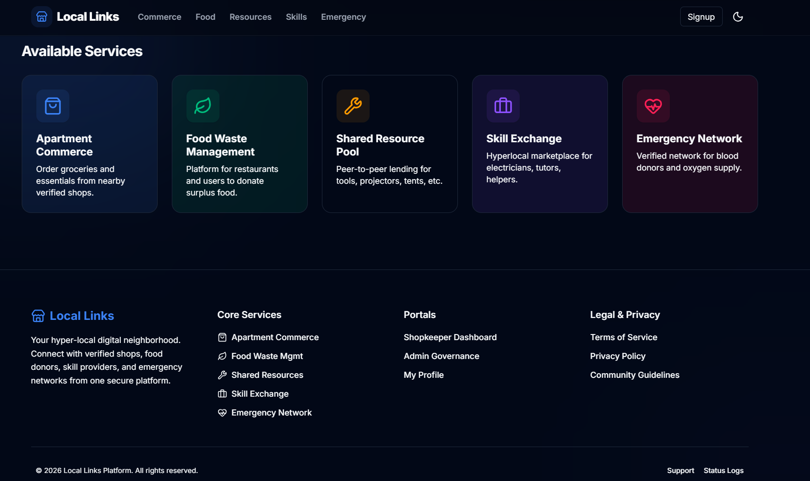

# 📍 Local Link

<div align="center">


</div>

---

### 🚀 Hyperlocal connections for buying, sharing, and emergency help.

**Local Link** is a neighborhood platform that connects residents, shopkeepers, NGOs, and service providers to reduce waste, support local commerce, share resources, and enable emergency assistance.

---

## 📍 Table of Contents
- [✨ Key Features](#-key-features)
- [🛠 Tech Stack](#-tech-stack)
- [📸 Visuals](#-visuals)
- [📂 Repository Layout](#-repository-layout)
- [🚀 Quick Start (Local Development)](#-quick-start-local-development)
- [🔗 Core API Groups](#-core-api-groups)
- [📜 Documentation](#-documentation)
- [🤝 Contributing](#-contributing)
- [📜 License](#-license)

---

## ✨ Key Features
- **Food waste management:** surplus listings, claims, pickup flow
- **Apartment commerce:** nearby shops, inventory browsing, cart and orders
- **Shared resources:** peer-to-peer rentals with booking/deposit flow
- **Emergency network:** blood and medicine availability by locality
- **ML microservice:** demand prediction and recommendation endpoints
- **Planned module:** skill exchange service provider booking flow

---

## 🛠 Tech Stack
- **Frontend:** Next.js (App Router)
- **Backend:** Node.js + Express
- **Database:** MongoDB + geospatial queries
- **ML service:** FastAPI
- **Auth:** JWT + role-based guards
- **Tooling:** pnpm, nodemon

---

## 📸 Visuals




---

## 📂 Repository Layout
```text
Local-Link/
|-- backend/
|   |-- src/
|   |   |-- config/
|   |   |-- controllers/
|   |   |-- middlewares/
|   |   |-- models/
|   |   |-- routes/
|   |   `-- server.js
|   |-- package.json
|   `-- .env.example
|-- frontend/
|   |-- app/
|   |-- components/
|   |-- context/
|   `-- package.json
|-- ml-service/
|   |-- main.py
|   `-- requirements.txt
`-- Documentation/
    |-- SRS.md
    |-- architecture.md
    |-- use_cases.md
    |-- security.md
    `-- contribute.md
|-- .github/
|   |-- PULL_REQUEST_TEMPLATE.md
|   `-- ISSUE_TEMPLATE/
|       |-- bug_report.yml
|       |-- feature_request.yml
|       |-- question.yml
|       `-- config.yml
`-- contribution.md
```
## 🚀 Quick Start (Local Development)

Follow these steps to run the full project locally.

---

### 🖥️ 1) Backend

```bash
cd backend
pnpm install
cp .env.example .env
pnpm dev
```

* Runs on: http://localhost:5000
* You can override the port using the `PORT` environment variable.

---

### 🌐 2) Frontend

```bash
cd frontend
pnpm install
pnpm dev
```

* Runs on: http://localhost:3000

Create a `.env.local` file in `frontend/` with:

```env
NEXT_PUBLIC_API_BASE_URL=http://localhost:5000/api
```

---

### 🤖 3) ML Service

```bash
cd ml-service
python -m venv .venv
```

**Activate virtual environment:**

* Windows (PowerShell):

```bash
.\.venv\Scripts\Activate.ps1
```

* macOS/Linux:

```bash
source .venv/bin/activate
```

```bash
pip install -r requirements.txt
uvicorn main:app --reload --port 8000
```

* Runs on: http://localhost:8000

---

## 🔌 Core API Groups

| Service   | Endpoints             |
| --------- | --------------------- |
| Auth      | `/api/auth/*`         |
| Commerce  | `/api/v1/commerce/*`  |
| Food      | `/api/food/*`         |
| Resources | `/api/v1/resources/*` |
| Emergency | `/api/v1/emergency/*` |
| ML Health | `GET /health`         |

---

## 📚 Documentation

All detailed documentation is available inside the `Documentation/` folder:

* `SRS.md` — Software Requirements Specification
* `architecture.md` — System design & architecture
* `use_cases.md` — Functional scenarios
* `security.md` — Security considerations
* `contribute.md` — Contribution guide

Additional:

* `contribution.md` — Setup, workflow, PR guidelines

---

## 🤝 Contributing

We follow a structured Git workflow:

### 📌 Branch Naming

* `feat/<feature-name>`
* `fix/<bug-name>`
* `docs/<topic>`

### 📝 Commit Convention

* `feat(module): short description`
* `fix(module): short description`
* `docs: update <topic>`

Make sure to:

* Keep PRs focused and small
* Write clear descriptions
* Link related issues

👉 See `contribution.md` for complete guidelines.

---

## 📄 License

This project currently does not include a license.

You can add one by creating a `LICENSE` file (e.g., MIT License).
